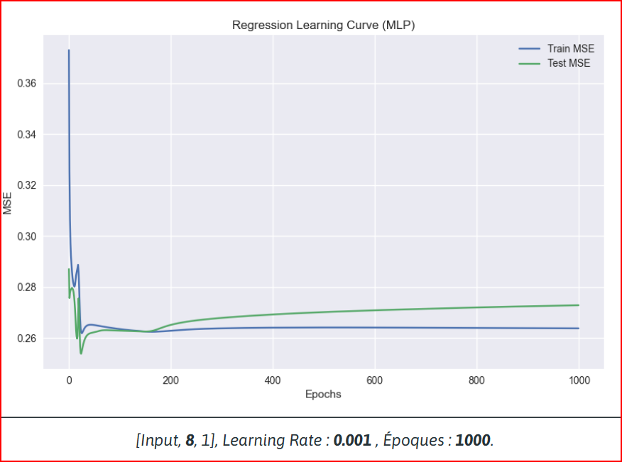
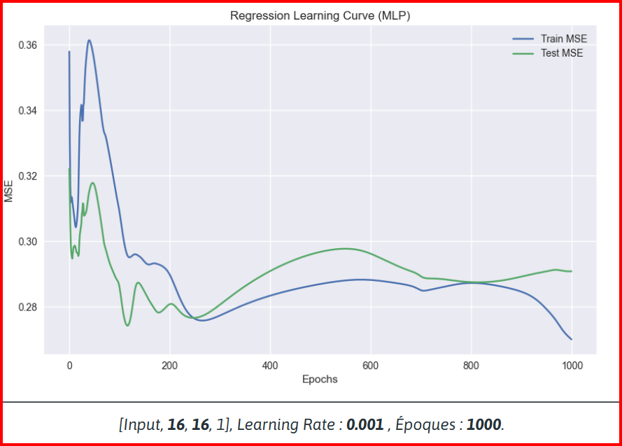
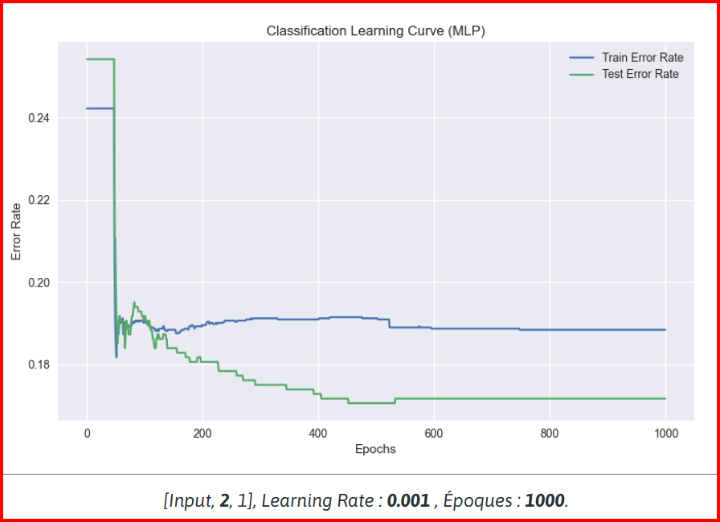
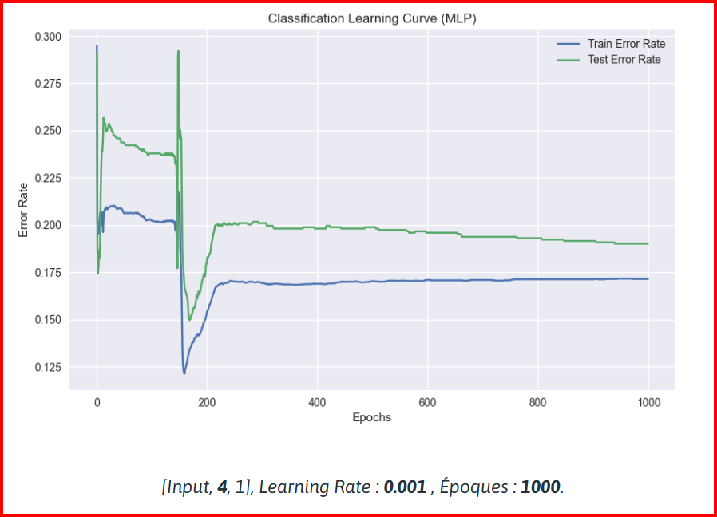
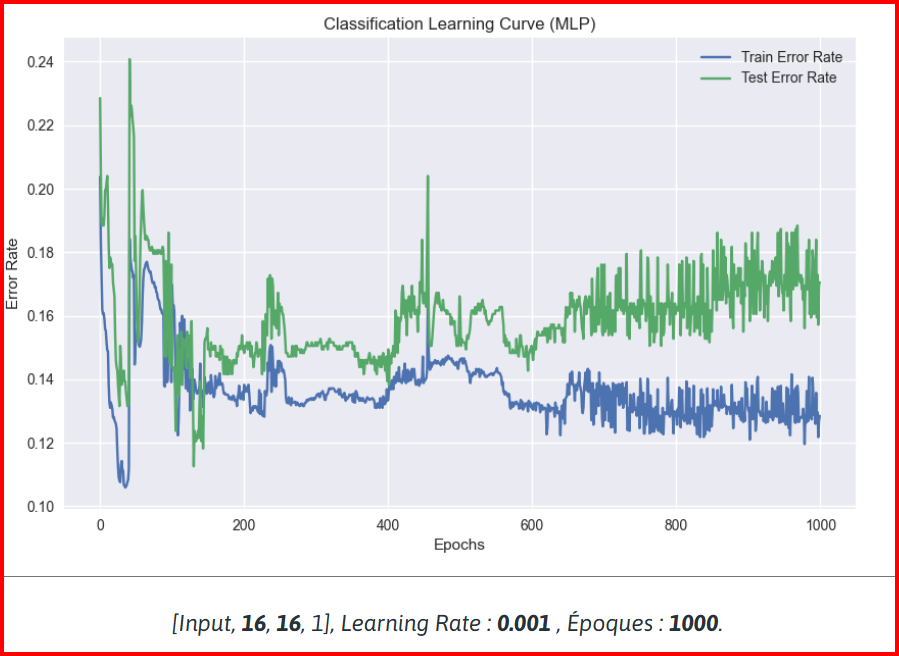
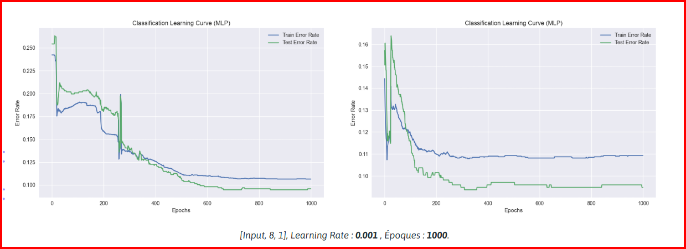

# Rapport : Projet PaddleCatcher

## 1. Contexte et Définition du problème
### *Vers une IA qui imite l’humain*

L'objectif de ce projet est de développer un agent artificiel capable de jouer au jeu *PaddleCatcher* en imitant le comportement d'un joueur humain. Contrairement à une approche algorithmique classique (règles "if/else"), l'**Apprentissage Supervisé** (Supervised Learning) est utilisé.

Le problème se formalise ainsi :
*   **Entrées ($X$)** : L'état du jeu à un instant $t$. Cela comprend la position horizontale du Paddle ($P_x$) et les positions $(x, y)$ des balles visibles à l'écran.
*   **Sortie ($Y$)** : L'action effectuée par le joueur humain.
*   **Objectif** : Entraîner un Réseau de Neurones (MLP) à approximer la fonction de décision humaine $f(X) \approx Y_{humain}$.

---

## 2. Architecture Technique
### *Allier performance et flexibilité*

Pour répondre aux contraintes de performance (temps réel dans un jeu vidéo) et de flexibilité (analyse de données), une architecture hybride a été conçue :

1.  **Unity (C#)** : Moteur de jeu. Il gère la physique, le rendu et l'interface utilisateur. Il est responsable de la collecte des données (enregistrement des parties en CSV) et de l'inférence (appel du modèle entraîné).
2.  **Rust (`RustLib`)** : Cœur de l'IA. Une bibliothèque compilée en DLL native pour une performance maximale. Elle implémente les structures de données (MLP, Perceptron) et les algorithmes de propagation avant/arrière.
3.  **Python (Jupyter)** : Laboratoire d'expérimentation. Utilisé pour charger les données CSV, orchestrer l'entraînement via la DLL Rust, et générer les courbes d'analyse.

Ce découpage permet d'avoir le meilleur des deux mondes : la facilité d'analyse de Python et la vitesse d'exécution de Rust/C#.

---

## 3. Expérimentations
### *Une démarche itérative*

La méthodologie repose sur un cycle scientifique rigoureux : **Collecte $\rightarrow$ Entraînement $\rightarrow$ Analyse**.

#### 3.1 Expérience 1 : La Régression (Échec)
Une première tentative a visé à prédire la valeur exacte du stick (continue entre -1.0 et 1.0).
*   **Protocole** : Joueur au Clavier. Modèle MLP. Fonction de coût MSE.
*   **Résultats** :
    *   *Phase A (Modèle Simple - 8 neurones)* : L'erreur stagne rapidement (Plateau à 0.23). Le modèle apprend la moyenne (0) et ne capture aucune stratégie.
    
    *   *Phase B (Modèle Complexe - 16 neurones)* : L'erreur de test remonte brutalement après 400 époques. C'est du **Sur-apprentissage (Overfitting)**.
    
*   **Conclusion** : L'échec est structurel. L'utilisation d'un **Clavier** (valeurs discrètes -1, 0, 1) est incompatible avec une régression qui cherche une fonction continue lisse. Le modèle ne peut qu'apprendre le bruit ou la moyenne.

#### 3.2 Expérience 2 : La Classification (Succès)
Le problème a été reformulé en Classification : prédire une classe (Gauche / Droite / Rien).
Une étude comparative de l'architecture (nombre de neurones dans la couche cachée) a été menée :

*   **2 Neurones (Trop Petit)** : **Sous-apprentissage**. Erreur ~17%. Le modèle manque de capacité pour saisir les nuances du jeu.
    
*   **4 Neurones (Instable)** : Erreur ~19%. Le modèle oscille et n'arrive pas à converger proprement.
    
*   **16 Neurones (Trop Gros)** : **Sur-apprentissage**. Apparition de pics d'instabilité et écart grandissant entre l'entraînement et le test.
    
*   **8 Neurones (Optimal)** : **Convergence Parfaite**.
    *   L'erreur chute drastiquement vers l'époque 250 (le "déclic").
    *   Stabilisation à **9% d'erreur** (91% de précision).
    *   Robustesse validée par plusieurs entraînements indépendants.
    

C'est donc l'architecture à **8 neurones** qui a été retenue.

---

## 4. Conclusion
### *Résultats et futures améliorations*

Ce projet a permis de valider une chaîne technique complète et de produire une IA fonctionnelle capable d'imiter un humain avec plus de 90% de fidélité.

**Analyse Critique (Quantité vs Qualité)** :
Bien que le volume de données soit suffisant (Ratio de **94x** le nombre de paramètres), l'IA reproduit les biais du joueur (tendance à rester à gauche). C'est l'illustration du principe **"Garbage In, Garbage Out"** : la performance de l'IA est plafonnée par la qualité de distribution des données d'entraînement, pas par l'architecture du réseau.

**Perspectives** :
1.  **Data Augmentation** : Appliquer une symétrie miroir au dataset pour doubler sa taille et éliminer le biais latéral.
2.  **Enrichissement** : Ajouter la vitesse du paddle et des balles en entrée pour permettre l'anticipation physique.
3.  **Apprentissage par Renforcement** : Laisser l'IA jouer seule pour maximiser son score, afin de dépasser les limites du niveau humain.
