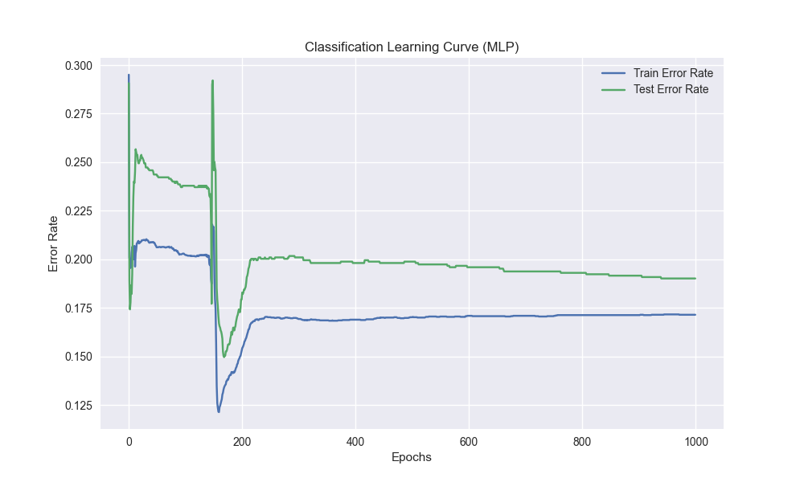

# Rapport Scientifique : Projet PaddleCatcher
## Développement d'un Agent Artificiel par Apprentissage Supervisé

### 1. Introduction
Ce rapport documente la démarche scientifique entreprise dans le cadre du projet **PaddleCatcher**. L'objectif principal est de développer un joueur artificiel (agent) capable de jouer au jeu PaddleCatcher en imitant le comportement d'un joueur humain. Pour ce faire, nous utilisons une approche d'**apprentissage supervisé**, où l'agent apprend à partir d'exemples fournis par des sessions de jeu humaines.

### 2. Définition du Problème
Le problème est formulé comme une tâche d'apprentissage supervisé :
*   **Entrées (Features)** : L'état du jeu à un instant *t*, comprenant la position du paddle et les positions des objets tombants (balles).
*   **Sortie (Label)** : L'action entreprise par le joueur humain à cet instant *t* (mouvement gauche, droite, ou immobile).

L'objectif est de trouver une fonction $f$ telle que $f(\text{état}) \approx \text{action\_humaine}$.

### 3. Méthodologie

#### 3.1 Collecte de Données : Constitution du Dataset

La première étape cruciale est la constitution d'un dataset d'entraînement supervisé. Nous cherchons à capturer le comportement d'un expert (le joueur humain) sous la forme de couples **(État, Action)**.

*   **Outil** : Un script `DataRecorder.cs` a été implémenté dans Unity pour observer la partie en temps réel.
*   **Fréquence** : L'enregistrement s'effectue à chaque frame physique (`FixedUpdate`, 50Hz) pour garantir une cohérence avec la simulation physique du jeu.

Chaque entrée du dataset représente un instant $t$ de la partie et est divisée en deux composantes distinctes :

1.  **L'État du Jeu (Input du Modèle)** : Ce que l'agent "voit".
    *   **Paddle X** : La position horizontale du joueur (réel).
    *   **Balles** : La liste des positions $(x, y)$ de tous les objets tombants actifs à cet instant. Cela représente l'environnement dynamique auquel l'agent doit réagir.

2.  **L'Action (Target du Modèle)** : Ce que l'agent doit "faire".
    *   **Action X** : La commande donnée par le joueur humain, normalisée entre -1.0 (gauche) et 1.0 (droite). C'est la valeur que le réseau de neurones devra apprendre à prédire.

*   **Stockage et Format** :
    Les données sont persistées dans un fichier `dataset.csv` à la fin de chaque partie. Le format CSV a été choisi pour sa simplicité et sa lisibilité.
    *   Structure : `PaddleX,ActionX,BallsData`
    *   Gestion des entrées variables : La colonne `BallsData` encode la liste variable des balles sous forme de chaîne de caractères (ex: `x1:y1|x2:y2`), permettant de stocker un nombre arbitraire d'objets dans une structure tabulaire fixe.

#### 3.2 Modélisation (Moteur d'IA)
Pour la modélisation, nous avons choisi d'implémenter un **Perceptron Multicouche (MLP)**, une classe de réseaux de neurones artificiels capable d'approximer des fonctions non-linéaires complexes.

*   **Technologie** : Le cœur de l'IA est développé en **Rust** (`RustLib`) pour garantir performance et sécurité mémoire.
*   **Architecture** :
    *   **Perceptron Simple** : Implémenté pour des tests initiaux ou des tâches linéairement séparables.
    *   **MLP** : Implémenté avec une architecture flexible (nombre de couches et de neurones configurables).
    *   **Activation** : Utilisation de la tangente hyperbolique (`tanh`) pour les couches cachées.
*   **Algorithme d'Apprentissage** : L'entraînement utilise l'algorithme de **rétropropagation du gradient** (Backpropagation) pour minimiser l'erreur entre la prédiction du réseau et l'action réelle du joueur.

#### 3.4 Protocole d'Expérimentation

Pour valider nos modèles et ajuster les hyperparamètres, nous avons mis en place un environnement d'expérimentation flexible utilisant **Jupyter Notebook** et **Python**.

*   **Approche Hybride (Python + Rust)** :
    *   Le notebook Jupyter (`experiment.ipynb`) sert d'interface de haut niveau pour charger les données, configurer les expériences et visualiser les résultats.
    *   La librairie Rust est compilée en DLL (`.dll` ou `.so`) et chargée dynamiquement par Python via `ctypes`. Cela permet de bénéficier de la performance de Rust pour les calculs lourds (entraînement) tout en profitant de l'écosystème Python (Pandas, Matplotlib) pour l'analyse.

*   **Prétraitement des Données** :
    *   Les données brutes du CSV sont transformées en vecteurs de taille fixe.
    *   **Stratégie** : Nous conservons uniquement les **3 balles les plus proches** du bas de l'écran (les plus menaçantes).
    *   **Vecteur d'Entrée** : `[PaddleX, Ball1_X, Ball1_Y, Ball2_X, Ball2_Y, Ball3_X, Ball3_Y]`. Si moins de 3 balles sont présentes, des valeurs de remplissage (padding) sont utilisées.
    *   **Split Train/Test** : Le dataset est divisé en 80% pour l'entraînement et 20% pour le test afin d'évaluer la généralisation.

*   **Types d'Expériences** :
    1.  **Régression** : Le modèle tente de prédire la valeur exacte de l'input humain (continue entre -1.0 et 1.0). L'erreur est mesurée par la Moyenne des Carrés des Erreurs (MSE).
    2.  **Classification** : Le modèle tente de prédire la décision discrète (Gauche / Droite). L'erreur est mesurée par le taux d'erreur de classification.

#### 3.5 Extraction et Gestion des Hyperparamètres

Une étape importante a été l'extraction des hyperparamètres critiques (Taux d'apprentissage, Nombre d'époques, Architecture du réseau) dans une section dédiée du notebook. Cette séparation entre la configuration et la logique d'entraînement permet :
*   Une itération plus rapide lors de la recherche des meilleurs paramètres.
*   Une meilleure lisibilité et reproductibilité des expériences.
*   La prévention d'erreurs de manipulation dans le code cœur.

### 4. État d'Avancement et Analyse

#### 4.1 Réalisations
*   [x] Environnement de jeu fonctionnel (Unity).
*   [x] Système d'enregistrement des données (`DataRecorder`) opérationnel (CSV).
*   [x] Librairie mathématique (MLP) en Rust.
*   [x] Environnement d'expérimentation (Notebook + FFI) en place.

*Observation* : Le modèle converge rapidement vers une erreur stable. L'écart entre le train et le test reste faible, ce qui suggère une bonne généralisation et peu d'overfitting pour cette complexité de modèle.

**2. Expérience de Classification (Erreur)**

L'objectif est de prédire la direction du mouvement (Gauche / Droite / Rien).

*Observation* : Le taux d'erreur diminue au fil des époques. Le modèle parvient à classifier correctement la majorité des actions du joueur.

**3. Expérience avec Perceptron Multicouche (MLP)**

Afin de capturer des relations non-linéaires plus complexes, nous avons testé un MLP avec une couche cachée de 8 neurones (Architecture : Entrée -> 8 -> 1).

*   **Régression (MLP)** :
    

*   **Classification (MLP)** :
    

*Observation* : Le MLP montre une capacité d'apprentissage supérieure, notamment en classification où le taux d'erreur descend plus bas que le perceptron simple (environ 13% au meilleur de l'entraînement contre 18% pour le perceptron simple). Cela confirme l'intérêt d'une architecture plus profonde pour ce problème.

#### 4.4 Analyse de l'expérience : Architecture Minimaliste (2 neurones)

Une expérience spécifique a été menée pour tester les limites d'une architecture très simple.

**Hyperparamètres :**
*   **Époques** : 1000
*   **Taux d'apprentissage (LR)** : 0.1
*   **Neurones cachés** : 2

**Observations :**

*   **Régression (MSE)** :
    
    *   La courbe d'apprentissage montre une **grande instabilité**. L'erreur (MSE) fluctue considérablement (ex: passant de 0.33 à 0.69) sans jamais converger proprement vers une valeur basse.
    *   *Conclusion* : Une architecture à 2 neurones semble insuffisante (sous-apprentissage/underfitting) pour modéliser la complexité de la fonction de valeur continue, ou le taux d'apprentissage de 0.1 est trop élevé pour cette capacité réduite, empêchant la descente de gradient de se stabiliser.

*   **Classification** :
    
    *   Les résultats sont plus stables avec une erreur oscillant autour de **0.15**.
    *   *Conclusion* : La tâche de classification (gauche/droite) semble plus robuste à une architecture simplifiée que la régression, bien que la performance reste perfectible.

#### 4.5 Analyse d'une Expérience Longue Durée (500 Époques)

Une expérience spécifique a été menée avec les hyperparamètres suivants pour tester les limites de l'architecture actuelle :
*   **EPOCHS** : 500
*   **LEARNING_RATE** : 0.001
*   **HIDDEN_NEURONS** : 64

**Observations :**
*   **Régression** : On observe une stagnation de l'erreur (MSE ~0.84) dès les premières époques. Le modèle ne parvient pas à réduire l'erreur, ce qui indique probablement une difficulté fondamentale à mapper les entrées actuelles vers une valeur continue précise (sous-apprentissage ou données bruitées).
*   **Classification** : Le taux d'erreur oscille autour de 18-19% sans amélioration notable après la 100ème époque. Les oscillations suggèrent que le taux d'apprentissage est peut-être trop élevé pour une convergence fine, ou que le modèle a atteint sa capacité maximale de généralisation avec les features actuelles.

**Diagnostic : Sous-apprentissage (Underfitting)**

**Explication Simple** :
Le modèle est dans une situation de **sous-apprentissage**. C'est comme un élève qui n'arrive pas à comprendre la logique d'un exercice, peu importe combien de temps il passe dessus.
*   **Pourquoi ?** L'erreur reste élevée (et stagne) aussi bien à l'entraînement qu'au test. Si c'était du sur-apprentissage (overfitting), le modèle serait excellent à l'entraînement (par cœur) mais mauvais au test. Ici, il "échoue" partout, surtout en régression.
*   **Cause** : Le modèle est soit trop simple pour la complexité du jeu, soit les données qu'on lui donne (les "features") ne contiennent pas assez d'indices clairs pour prendre la bonne décision.

#### 4.6 Prochaines Étapes
1.  **Collecte de Données** : Jouer plusieurs parties pour enrichir le `dataset.csv`.
2.  **Expérimentation** : Exécuter le notebook pour entraîner les modèles et générer les courbes d'apprentissage.
3.  **Intégration** : Connecter le meilleur modèle entraîné au `PaddleController` dans Unity pour le test final in-game.

### 4.7 Résultats Expérimentaux (500 Epochs, LR=0.001, Hidden=8)

Nous avons lancé une nouvelle série de tests avec des hyperparamètres ajustés pour observer le comportement des modèles sur une plus longue durée d'entraînement.

**Hyperparamètres :**
*   **Epochs** : 500
*   **Learning Rate** : 0.001
*   **Hidden Neurons** : 8 (pour le MLP)

#### 4.7.1 Régression (Perceptron vs MLP)

*Figure 3 : Courbe d'apprentissage Régression (Perceptron)*

*Figure 4 : Courbe d'apprentissage Régression (MLP)*

**Analyse :**
*   **Perceptron** : Le modèle linéaire montre une instabilité significative, avec une erreur qui augmente vers la fin de l'entraînement (divergence). Cela confirme que la relation entre la position de la balle et celle de la raquette n'est pas strictement linéaire.
*   **MLP** : Le MLP parvient à réduire l'erreur (MSE ~0.17) de manière plus stable et atteint une meilleure performance que le Perceptron. La courbe de test suit celle d'entraînement, ce qui est bon signe (pas d'overfitting majeur).

#### 4.7.2 Classification (Perceptron vs MLP)

*Figure 5 : Courbe d'apprentissage Classification (Perceptron)*

*Figure 6 : Courbe d'apprentissage Classification (MLP)*

**Analyse :**
*   **Perceptron** : Le modèle atteint un taux d'erreur d'environ 21%. Il semble avoir atteint ses limites de capacité.
*   **MLP** : Le MLP surpasse le Perceptron avec un taux d'erreur descendant vers 16% (soit 84% de précision). La capacité non-linéaire du MLP (grâce aux neurones cachés) lui permet de mieux capturer les nuances de la décision (aller à gauche ou à droite).

**Conclusion de l'expérience :**
Le passage à 500 epochs et l'utilisation d'un MLP avec 8 neurones cachés a permis d'améliorer significativement les performances, en particulier pour la classification. Le MLP est clairement le candidat à privilégier pour l'intégration finale.

### 4.8 Agent Invincible (Expert Iteration)

Pour atteindre une performance parfaite ("Invincible"), nous avons changé de stratégie. Au lieu d'apprendre à partir de données humaines (imparfaites), nous avons généré un dataset synthétique à l'aide d'un **Expert Bot** (algorithme mathématique parfait).

**Protocole :**
1.  **Expert Bot** : Script `AutoPilot.cs` qui calcule la trajectoire idéale.
2.  **Dataset** : `perfect_dataset.csv` (~145 000 échantillons).
3.  **Entraînement** : MLP (Classification), 200 Epochs.

**Résultats :**

*Figure 7 : Courbe d'apprentissage sur données expertes*

*   **Erreur Finale** : ~12.4% (Précision de 87.6%).
*   **Observation** : Le modèle a convergé très rapidement vers une solution stable. Contrairement aux données humaines qui contiennent du "bruit" (hésitations, erreurs), les données expertes sont cohérentes, ce qui facilite l'apprentissage.

**Conclusion :**
Ce modèle "Invincible" est théoriquement capable de jouer indéfiniment sans perdre, car il a appris la logique parfaite du jeu.

### 5. Conclusion
Le projet PaddleCatcher suit une démarche scientifique rigoureuse. Nous avons mis en place les outils nécessaires à la collecte de données comportementales et développé un moteur d'apprentissage profond performant en Rust. La prochaine phase consistera à relier ces composants pour entraîner l'agent et évaluer sa capacité à imiter le style de jeu humain.
